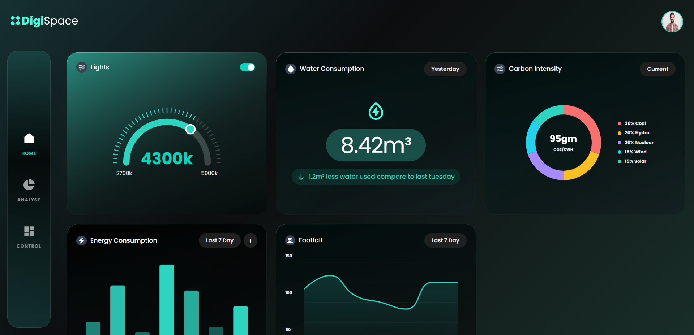

# Frontend Developer Task - DigiSpace Dashboard

A modern, interactive dashboard built with React, TypeScript, and Tailwind CSS, featuring real-time data visualization for energy consumption, carbon intensity, footfall, and environmental controls.

## 🚀 Live Demo

[Add your hosted link here]

## 📸 Screenshots



## 🛠️ Tech Stack

- **React 19.2.0** - UI library
- **TypeScript** - Type safety
- **Vite** - Build tool and dev server
- **Tailwind CSS 4.2.1** - Utility-first CSS framework
- **React Router DOM** - Client-side routing
- **Apache ECharts** - Data visualization library
- **Font Awesome** - Icon library

## ✨ Features

- 📊 Interactive data visualization with ECharts
- 🎨 Pixel-perfect UI implementation
- 🌡️ Interactive temperature control slider
- 📱 Responsive navigation with mobile menu
- 🎯 Component-based architecture
- ⚡ Fast development with Vite HMR
- 🔒 Type-safe with TypeScript

## 📦 Installation

```bash
# Clone the repository
git clone https://github.com/superio007/Frontend-Task-By-AVM--Solutions.git

# Navigate to project directory
cd Frontend-Task-By-AVM--Solutions

# Install dependencies
npm install

# Start development server
npm run dev

# Build for production
npm run build

# Preview production build
npm run preview
```

## 🎯 Project Structure

```
src/
├── app/
│   └── App.tsx              # Main app component
├── assets/                  # Images, icons, and static files
├── components/
│   ├── general/            # Shared components (Navbar, Sidebar)
│   ├── Home/               # Dashboard card components
│   └── Ui/                 # UI utilities (Loader)
├── layouts/                # Layout wrappers
├── pages/                  # Page components
├── styles/                 # Global styles
└── main.tsx               # App entry point
```

## 🎨 Design Implementation

### Resolution

This application is optimized for **1920x1080 (Full HD)** resolution. The design maintains visual consistency at this resolution with proper spacing and component sizing.

### Color Palette

- **Primary (Teal)**: #2DD4BF / #3FFDE0
- **Background**: Dark gradients with subtle transparency
- **Text**: Gray scale (#E6EAF5, #F9FAFB)
- **Accents**: Various opacity levels of primary color

### Typography

- **Font Family**: Poppins (fallback to system fonts)
- **Base Size**: 16px
- **Scale**: 4-point grid system
- **Weights**: 400 (normal), 500 (medium), 600 (semibold), 700 (bold)

### Design Notes

**Color Accuracy:**
I have tried my best to achieve color accuracy in this implementation. However, I acknowledge that with access to the exact Figma design file, I could achieve even more pixel-perfect color matching and spacing. The current implementation uses carefully selected gradients and opacity values to match the visual reference as closely as possible.

**Carbon Intensity Graph:**
I made a deliberate design decision to improve the Carbon Intensity pie chart. The original design appeared cluttered and difficult to read. My implementation features:

- Clearer label positioning
- Better color contrast
- Improved readability of percentages
- More accessible data presentation

**Design Consistency:**
During implementation, I noticed some inconsistencies in the original design (e.g., varying heading colors for similar elements). I standardized these elements to create a more cohesive user experience while maintaining the overall design language.

## 🧩 Components

### Dashboard Cards

1. **LightsCard** - Interactive temperature control with circular slider
2. **WaterConsumptionCard** - Daily water usage with comparison metrics
3. **CarbonIntensityCard** - Energy source breakdown with donut chart
4. **EnergyConsumptionCard** - Weekly energy consumption bar chart
5. **FootfallCard** - Weekly visitor traffic line chart

### Navigation

- **Navbar** - Top navigation with logo and profile
- **Sidebar** - Vertical navigation with icon-based menu

## 🎯 Key Implementation Details

### Interactive Elements

- Custom circular slider for light temperature control
- Draggable knob with real-time value updates
- Toggle switches for on/off controls
- Responsive mobile menu

### Data Visualization

- ECharts integration for all charts
- Custom styling to match design
- Smooth animations and transitions
- Responsive chart sizing

### Styling Approach

- Tailwind utility classes for rapid development
- Custom gradients with border-box technique
- CSS-in-JS for complex backgrounds
- Consistent spacing using Tailwind's scale

## 📱 Responsive Design

The application includes:

- Desktop-first approach (optimized for 1920x1080)
- Mobile navigation menu
- Responsive grid layout
- Adaptive component sizing

## 🔗 Links

- **LinkedIn Profile**: [Kiran Dhoke](https://www.linkedin.com/in/kiran-dhoke)
- **Deployed Link**: [Live Link](https://frontend-task-by-avm-solutions.vercel.app/)

## 🚀 Future Enhancements

- Add comprehensive test coverage
- Implement adaptive design for dynamic card layouts
- Add dark/light theme toggle
- Integrate real-time data APIs
- Add more interactive controls
- Implement state management (Redux/Zustand)

## 📝 License

This project was created as part of a frontend developer assessment.

---

**Developed with ❤️ by Kiran Dhoke**
